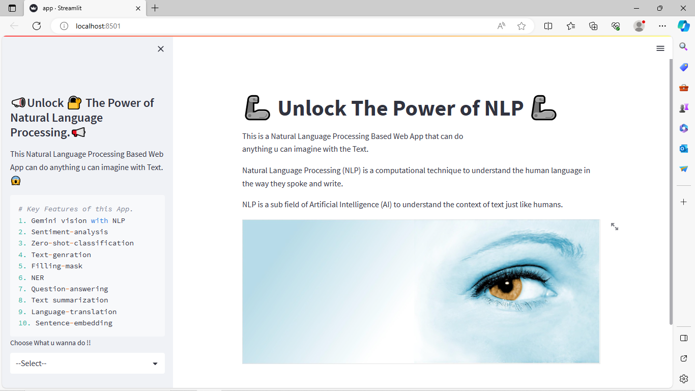
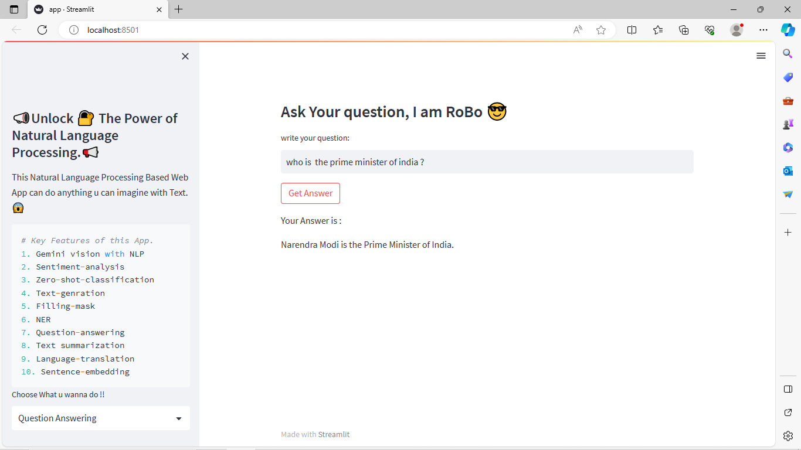
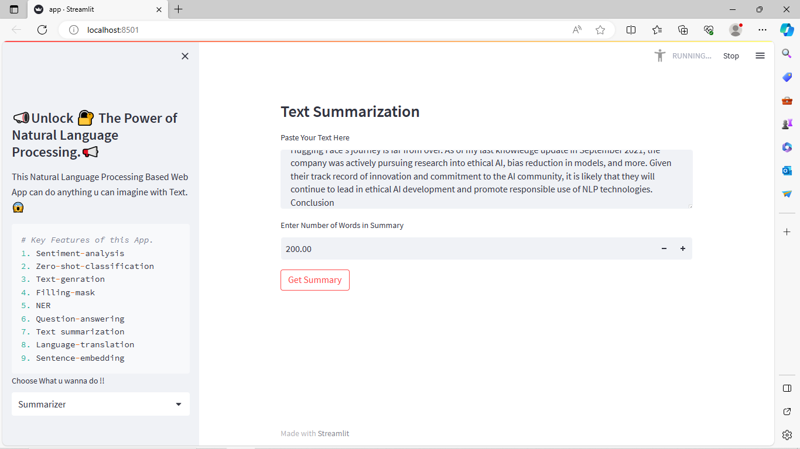
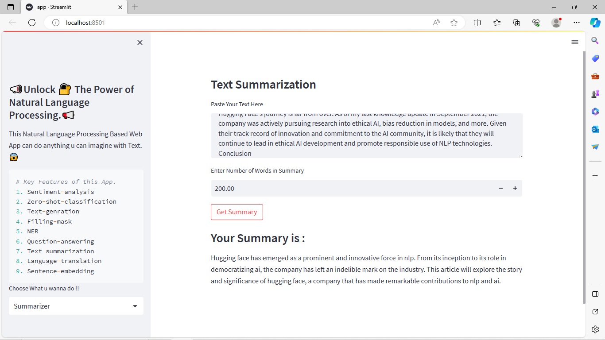
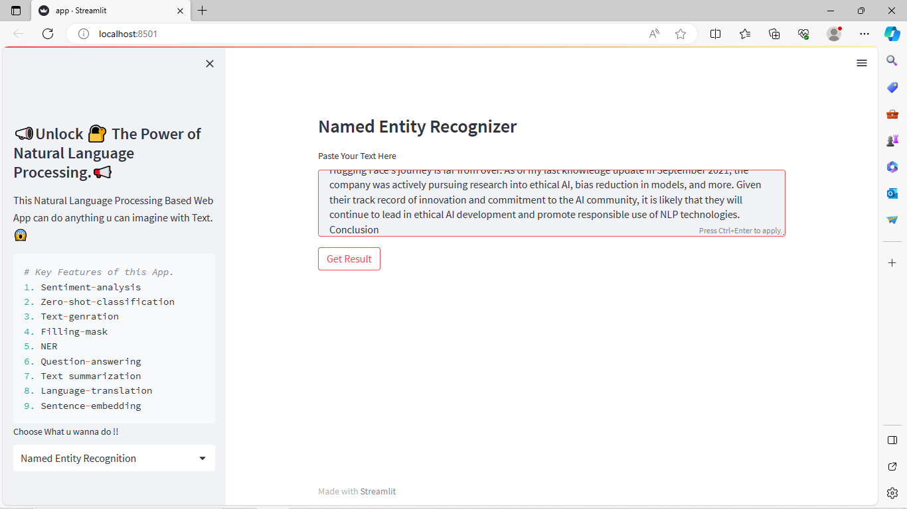
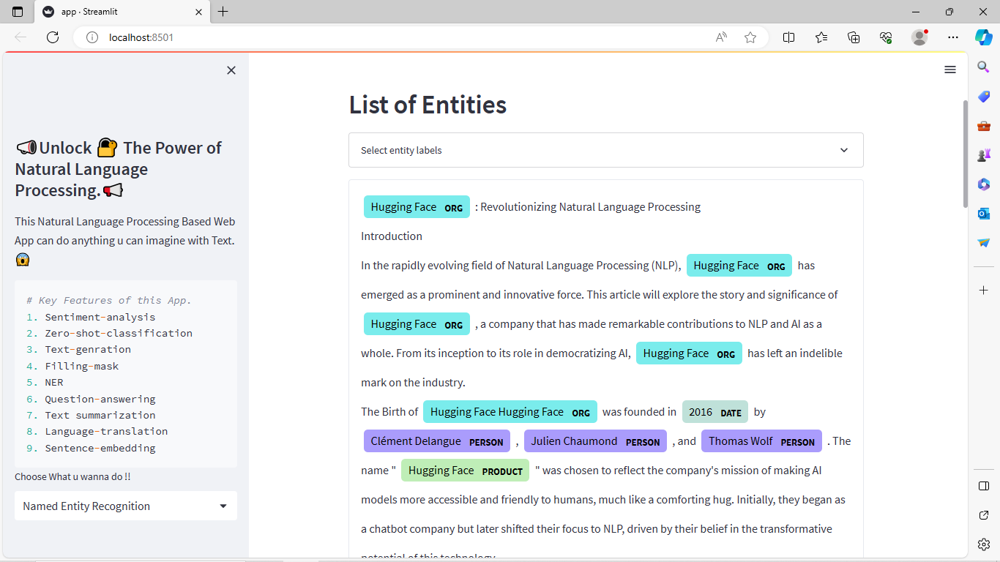
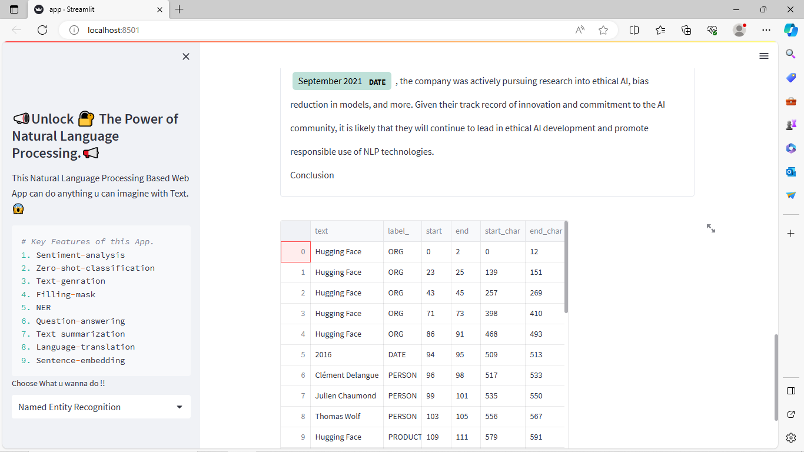
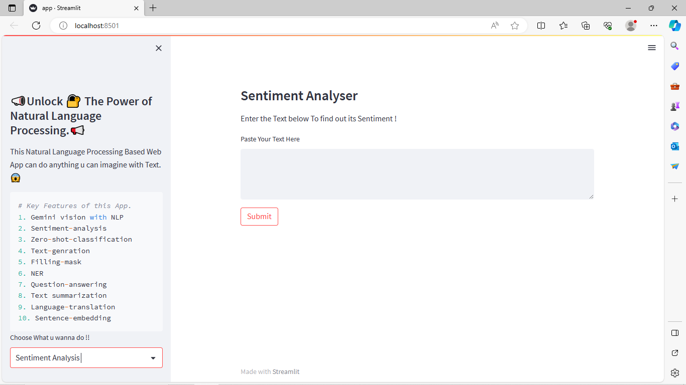
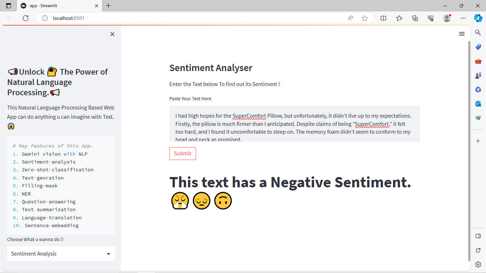
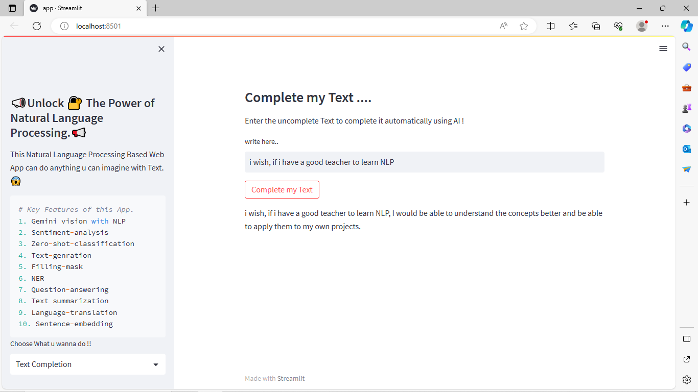

# a Web App, where you can perform all task of Nlp in a single web application 😎😎

You will be able to perform all these task in this app :
1. Sentiment-analysis
2. Zero-shot-classification
3. Text-genration
4. Filling-mask
5. NER
6. Question-answering
7. Text summarization
8. Language-translation
9. Sentence-embedding

## LLMs are working in back-end

1. Gemini pro
2. Gemini pro vision
3. GooglePalm
4. Google Bert
5. LLAMA2
6. GPT
7. google/pegasus-cnn_dailymail
8. sentence-transformers/all-MiniLM-L6-v2
9. Helsinki-NLP/opus-mt-en-hi
10. Falconsai/text_summarization
10. Transformers Based custome model.

### Demo of application

### Home Page


### Question Answering


### Text summarization




### Named Entity Recognition






### Sentiment Analysis





### Text Generator



### install Dependencies
```bash
pip install -r requirements.txt
```

```bash
python -m spacy download en_core_web_trf
```
### Steps To execute this app

Clone This repository
```bash
https://github.com/Ranjit-Singh-786/NLP_App.git
```

Get Your Google api key <a href="https://makersuite.google.com/app/apikey">Click on it </a>

create ".env file in current working directory"<br>
write :<br>
GOOGLE_API_KEY = "PASTE_YOUR_API_KEY"<br>

Get activate the enviroments of this project
```bash
NlpApp\Scripts\activate
```
Install dependencies
```bash
pip install -r requirements.txt
```
install model for Named Entity Recognition
```bash
python -m spacy download en_core_web_trf
```
Run command to execute the App
```bash
streamlit run app.py
```
### 🚧🚧🚧🚧 Project under in developing process 🚧🚧🚧🚧

